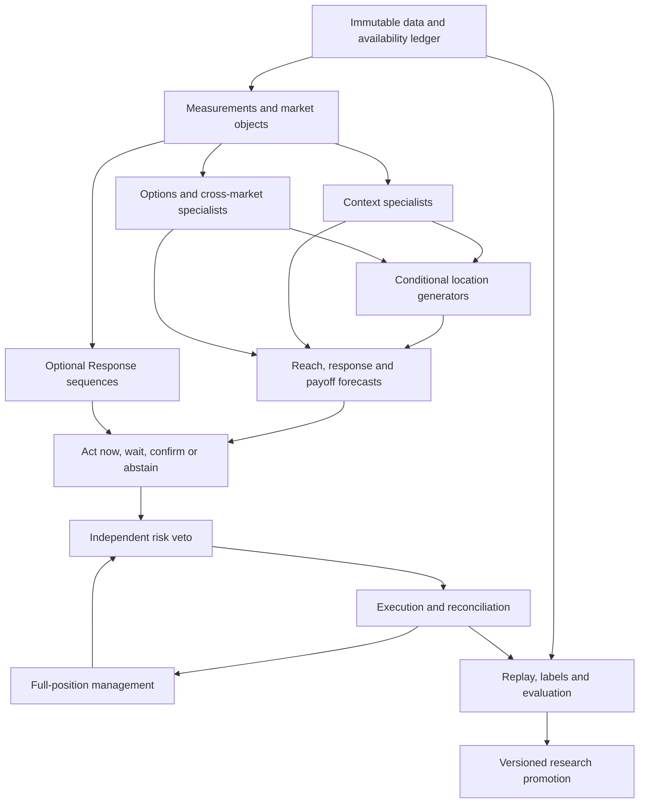

# Trading-model implementation plan

Design baseline: 2026-09-06. This package specifies future implementation and experiments. No production trading system, trained model or validated trading edge is delivered. The empirical objective remains **one account, flat or one NQ/ES mini, preferably NQ; at least $2,000 mean daily net P&L over eligible trading days including zero-trade days; daily loss objective at most $1,000; flat at the required day boundary**. Feasibility is unresolved. Neither copying accounts, trading micros nor increasing quantity may be used to satisfy the primary experiment.

Third-review elaborations are binding: [individual specialist phases](SPECIALIST_EXPERIMENT_PROGRAM.md), [how quality is judged](MODEL_QUALITY_AND_STOPPING_RULES.md), [rich IV/skew/VIX research](VOLATILITY_RESEARCH_SPEC.md), [exact E0 reference](E0_REFERENCE_EXPERIMENT.md), and [runtime scheduling](components/RUNTIME_SCHEDULER.md). The [third review](THIRD_DESIGN_REVIEW.md) explains the corrections and remaining empirical questions.

The later [market-data source contract](MARKET_DATA_SOURCE_CONTRACT.md) is also binding: use full acquired MBP-1 for supported futures, with derived BBO/trade views and explicit action/side/flag handling. The [complete implementation handoff](IMPLEMENTATION_HANDOFF.md) and [exact scope index](IMPLEMENTATION_SCOPE.md) carry all B00–B10 work through one continuing implementation thread, beginning at B00/B01; E0 is an early checkpoint.

The latest [full-system refinement](SYSTEM_REFINEMENT.md), [153 upgrade paths and 191 specific child bindings](UPGRADE_PATHS.md), and [implementation constructions](UPGRADE_CONSTRUCTIONS.md) apply to every family below. Preserve the original idea, earlier conversation/plan improvements and further candidate separately, with exact local comparisons and source clauses. New target/port definitions must pass the computation graph and chronological fit-closure checks. Stronger deterministic construction is eligible; added model complexity is not mandatory.

## Architecture and responsibilities

Retain **Context → Location → Response** as a useful description of market reasoning, with two corrections recommended by this review. First, Context and Location interact: context conditions object formation and forecasts, while current object topology is contextual evidence. Break the apparent cycle using versioned, timestamped state and a directed computation schedule. Second, trade selection, order placement, position management, independent risk and evaluation have separate responsibilities; they are not hidden inside Response.

At event batch `t`, normalize newly available observations and freeze pre-decision account state; update measurements; run the explicit primitive-forecast, local-options and cross-asset stages; generate Location objects; evaluate complete action alternatives; select; then recheck independent risk before dispatch. The binding [computation schedule](components/COMPUTATION_SCHEDULE.md) separates measurement/forecast ports, variance/path mixtures, input masks/action gates and baseline/Response variants. Any later refinement is a distinct one-pass node with no same-batch feedback into its own ancestors; otherwise it waits for the next batch. Version IDs alone do not make a circular graph valid.

This is a **granular expert research system**, not a promise that every module must be a neural network. Deterministic measurements preserve meaning and exact replay. Learned specialists estimate uncertain outcomes. Mixtures combine forecasts sharing a target. Rankers compare opportunities. Policies choose actions under account state. Every component is independently testable and replaceable; additional experts require a registered target, baseline, dependency and incremental test rather than a broad claim of novelty.

## Specification navigation and binding rules

The component documents form part of this master specification. The ten numbered fields in each component card are mandatory, with explicitly referenced common contracts binding on every card. Model candidates are research comparisons; no learned model is selected as superior before its acceptance gates pass.

| Document | Responsibility |
|---|---|
| [COMMON_CONTRACTS.md](components/COMMON_CONTRACTS.md) | Time, units, schemas, labels, training, mixtures, test and resource conventions |
| [FOUNDATIONS.md](components/FOUNDATIONS.md) | F-series deterministic data/replay/instrument services |
| [MEASUREMENTS.md](components/MEASUREMENTS.md) | M-series trade flow, cohort CVD, profiles, VWAP, swings and microstructure measurements |
| [CONTEXT.md](components/CONTEXT.md) | C-series range paths, auction state, volatility, events and remaining opportunity |
| [OPTIONS.md](components/OPTIONS.md) | O-series chain validation, surfaces, exposures, OI forecasts, flow and dynamic nodes |
| [CROSS_ASSET.md](components/CROSS_ASSET.md) | X-series mappings, transmission, joint boards and broader information universe |
| [LOCATION.md](components/LOCATION.md) | L-series causal objects, adaptive zones, conditional level quality and opportunity sets |
| [GATES_AND_SELECTION.md](components/GATES_AND_SELECTION.md) | G-series common-target mixtures, calibration, disagreement, ranking and value of waiting |
| [POLICY_EXECUTION_RISK.md](components/POLICY_EXECUTION_RISK.md) | P-series one-mini actions, full-position management, fills, daily/account risk and reconciliation |
| [RESPONSE_DEFERRED.md](components/RESPONSE_DEFERRED.md) | R-series preserved mechanisms, measurement dependencies and later comparison protocol |
| [RESEARCH_AND_OPERATIONS.md](components/RESEARCH_AND_OPERATIONS.md) | V-series labels, trials, promotion, drift, parity and diagnosis |

[DATA_CAPABILITY_AUDIT.md](DATA_CAPABILITY_AUDIT.md) governs input claims. [SOURCE_FINDINGS_AND_CONFLICTS.md](SOURCE_FINDINGS_AND_CONFLICTS.md) and [EXTERNAL_RESEARCH.md](EXTERNAL_RESEARCH.md) distinguish faithful source rules from proposed improvements. [REQUIREMENTS_TRACEABILITY.md](REQUIREMENTS_TRACEABILITY.md) maps every extracted finding and user ambition to its disposition, components and tests. [VALIDATION_PLAN.md](VALIDATION_PLAN.md) defines gates before implementation. [IMPLEMENTATION_BACKLOG.md](IMPLEMENTATION_BACKLOG.md) gives the build order and concrete deliverables.

## What changes relative to the earlier conversations

1. **Jumbo remains both Context and Location.** Keep build-window identity, prior-RTH value/range, break order, width, pre-existing sweeps, internal 25/50/75 geometry, edge-relative extensions, 09:40–09:50 timing and event-delayed branches separate. A single eventual day-type classifier cannot replace these. Learn probabilities from the observed prefix and preserve no-break/censoring states. Original formulas and chart anchors are benchmarks; adaptive clock/activity windows and conditional P-zone forecasts are challengers.
2. **Options create actionable locations as well as context.** Preserve strike × expiry × chain × asset × time, rather than reducing a board to one GEX sign. Model surface quality, OI uncertainty, mechanical repricing, node persistence/migration and cross-board structure. A small node can be actionable; the largest node can be unreachable. Node eligibility does not require a matching Jumbo/profile level.
3. **Next-report OI is a useful, limited label.** Forecast aggregate contract OI changes from prior reported OI and causal flow; calibrate uncertainty with later reports. This does not identify intraday dealer holdings, and expiry needs a separate model/censoring regime. Compare frozen-OI, volume-proxy and learned-update boards on identical samples, including the economic effect of better OI forecasts.
4. **NDX/NDXP is an explicit Nasdaq-side experiment.** Compare it with QQQ and their combination, controlling coverage and mapping uncertainty. SPX/SPXW/SPY receive parallel treatment for ES. Source SPX/SPY reactions can produce NQ opportunities without any local NQ/QQQ node. Coordinate conversion and predictive transmission are different models.
5. **CVD is a family of measurements.** Ordinary aggressor CVD, size-cohort CVD at trade level, each cohort's within-bar OHLC/extrema, inter-cohort divergence, cross-market SMT, options contracts/premium flow, delta-equivalent, gamma-, vega-, vanna- and charm-weighted flow remain distinct, including event-frozen and separately revalued paths. Size cohorts do not reveal participant identities. Exact trade-derived profiles and CVD replace bar proxies only if the comparison supports the change.
6. **Selection is sequential.** Compare the nearer opportunity now, a deeper candidate later, waiting for additional evidence and abstaining. Forecast reach, conditional path, fill/adverse selection, costs and remaining room. Log rejected candidates and unavailable ones. A profitable hindsight touch is not an available trade, and a late confirmation can destroy the original payoff.
7. **The one-mini account is the primary economic unit.** All exits close the full unit; trails and re-entry are allowed research choices subject to risk, but partial exits/adds are infeasible in the primary action set. A daily loss objective does not replace a firm's trailing account floor. Strategy net P&L, account survival and withdrawable cash have separate ledgers.
8. **Validation has failure ownership.** Data, labels, measurement, forecasts, gates, selection, execution, management and distribution shift each have diagnostics. A component must pass its applicable tests and demonstrate its invariant/risk role, individual increment or prespecified joint contribution in the complete policy; plausible measurements and attractive prediction scores alone do not earn production promotion.

These are proposed improvements to be tested, not proven 10–20× improvements. Useful prior ideas are retained with their original provenance. Universal confluence rules, hindsight OI/IV, fixed claimed win rates, inferred institutional identity, copied-account scaling and mandatory Response confirmation are rejected as general requirements.

## Information and execution universes

Execution candidates are the active NQ or ES outright mini contract. Primary instrument selection is made using training/development and the same-date common cohort, then frozen for each outer test; it is not chosen using that day's realized P&L. An optional future intraday NQ-versus-ES selector is a separate trial and must preserve maximum total exposure of one mini, prohibit simultaneous positions and model switching costs.

Information includes every supported acquired family: NQ/ES, other equity indices, rates, currency, metals/energy and volatility futures; index/ETF options; NQ/ES futures options; supported equity/ETF minute series and calendar information. The complete audit appendix is the scope registry. Missing or sparse assets are masked, not invented. Cash index daily data cannot certify intraday strike touches. Related ETF/futures proxies carry mapping uncertainty and their own test cohort. Non-equity instruments need their own calendars and price-unit normalization.

## Trading-day and accounting recommendation

Use exchange/business trading dates with sessions expressed in `America/New_York` and instrument-local exchange time where appropriate; store UTC nanoseconds. Define the eligible-day calendar before evaluating any strategy. Include every scheduled eligible day, even no-trade days, model abstention, outages and risk stops. Report data-incomplete days separately and do not delete losing/outage days retrospectively to lift the mean. A research cohort can exclude demonstrably unusable historical data only by rules frozen before observing strategy outcomes; the operational future ledger counts outages.

Recommended primary net is realized futures P&L after commissions, exchange/broker fees, spread, slippage, boundary flattening and financing where applicable. Account purchase/reset/platform/data costs and payout splits/buffers belong in a second cash ledger, with transparent amortization and cash dates. An optional user clarification on which net measure defines success is recorded in the open questions; both are evaluated. With one NQ, $2,000 is 100 net points per eligible day; with one ES it is 40 net points. These are arithmetic requirements, not forecasts. A daily stop is not guaranteed to contain a gap or outage within $1,000, so tail overshoot is measured explicitly.

## Early complete experiments, before the larger specialist program

**E0 — Integrity and economics harness.** Replay a stratified small cohort, generate prior-RTH and frozen 06–09 objects, use a single transparent conditional-frequency/logistic path model, and simulate one-mini marketable entries with full-position exits and independent daily/boundary risk. Compare always-flat, a simple time/range strategy, and a regularized tabular end-to-end competitor on identical data. Its purpose is to verify the complete causal/P&L chain, expose target difficulty and produce a baseline against which individual and joint improvements are measured. The [E0 reference experiment](E0_REFERENCE_EXPERIMENT.md) fixes the initial cohort, features, target clocks, action/stop/exit choices and cost/timing scenarios; it is a harness baseline, not the final architecture.

**E1 — Jumbo discrimination.** Faithful 06–09 and prior-RTH benchmarks versus adaptive widths/windows/P-zones. Factorial ablations separate formation, contextual path classification, object quality and selection. Include internal continuation, internal reversal, extensions, single/double/no-break, ordered sweeps and event-delayed paths. Use matched density/distance/width/time placebo levels and log all candidates.

**E2 — Options/NDX incremental contribution.** On shared covered dates compare futures-only; QQQ only; NDX/NDXP only; combined Nasdaq; SPX/SPXW/SPY source-only events; all supported chains. Separately compare static prior-OI, mechanical repricing, volume proxy, learned OI update and dynamic-node models. Start with transparent aggregation and calibrated tabular forecasts; then test set/graph temporal representations on exactly the same masks and targets. Run both pre-touch forecasts and executable source-reaction NQ policies.

**E3 — Rich volatility and remaining room.** Compare seasonal historical range, Parkinson/GK/YZ, asymmetric ARCH/GARCH, noise-aware RV/semivariance/HAR, jumps, ATM/smile/skew/curvature/term/event variance, implied-versus-physical gaps, intraday surface dynamics, 0DTE remainder, VIX-option forward/surface/VVIX and daily VX curve experts. The [expanded volatility specification](VOLATILITY_RESEARCH_SPEC.md) defines each independent target, its data gate and its role in future excursions and remaining-session distributions. Translate forecasts into width, reach and payoff decisions; require improvements beyond better variance error.

**E4 — Flow/profile selection.** Compare faithful Pine/bar allocation against real trade-at-price volume and delta, anchored profiles and participant-proxy CVD variants. Separate signal definition from level density and ranker quality. Test ordinary versus cohort close-only versus true cohort OHLC features with common causal anchors.

**E5 — Optional Response value, later.** Freeze selected Context/Location opportunity sets; compare entry at eligibility, simple price confirmation and each preserved Response mechanism. Measure rescued losers, lost winners, delay, worse price, non-fill and complete net/day. Full Response development follows the current Context/Location program; its measurement and logging dependencies are included now.

## Dependency order and promotion

Build F/V contracts and the minimum P harness first; then deterministic M and faithful L/C baselines; run E0 immediately. Add richer C and O/X information with availability masks and out-of-fold interfaces; improve L/G opportunity selection; run E1–E4. Only then deepen Response and management candidates without changing the frozen comparison sets. Each milestone produces versioned data, reproducible metrics, diagnostics and a decision record, not just source code.

A research component becomes eligible for integration only after semantic/causality gates and registered predictive comparisons. Integration promotion additionally requires conservative sequential economic improvement or an explicitly measured risk/data-quality benefit. Paper/shadow requires frozen models, receipt parity, restart/reconciliation, account rules and no unresolved critical defect. Live trading, data purchases, external account actions and materially costly jobs require later authorization. Finishing this plan does not grant it.
