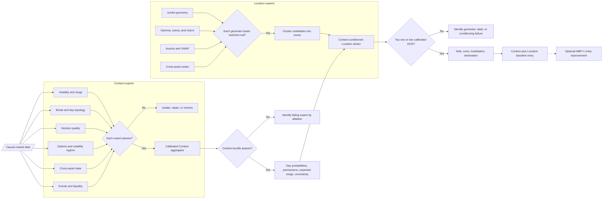

# Design robust feature levels — conversation transcript

Task ID: `01a068bb-1ee5-7d91-88b1-fc516323409a`

Exported 2026-09-06 from the complete local conversation record. Includes user messages and assistant final replies and progress messages in chronological order. System/developer instructions, internal reasoning, tool calls/results, and environment metadata are excluded. Attachment references are preserved as written; attachment contents and image pixels are not embedded. Markdown, links, and Mermaid source are preserved. Historical claims and proposals require independent assessment.

---

## User

You know the type of data that we are getting. So I want to understand how we can create proper levels of options data for our features. I know NDX open interest is usually accurate, but again, I don't think open interest is the best way to get proper levels because it's naive in a way.

Someone I think uses volume or voltage, I'm not sure what. But yeah. Just I need your opinion on how to create the best levels out of all the data that we have. That will usually catch proper reversals like that, runs a ton, basically, if that makes sense.

---

## Assistant — progress

I’ll first map the actual fields and history available in this workspace, then I’ll separate what can genuinely identify reversal zones from what merely describes positioning. The key distinction will be between structural levels, flow-confirmed levels, and a confidence score that avoids treating open interest as a standalone signal.

---

## Assistant — progress

The workspace itself is empty, so I can’t audit a schema or sample payload here. I’m going to frame this against the usual NDX options feed—strike/expiry, calls and puts, bid/ask, volume, open interest, IV/Greeks, spot, and timestamps—and I’ll be explicit about which conclusions require trade-direction or historical snapshots. I suspect the term you heard was “volatility,” “vanna,” or “gamma,” not “voltage.”

---

## Assistant

My opinion: the best NDX levels should come from an estimated hedging-pressure surface, not directly from open interest or raw volume.

Open interest should be the overnight structural prior. Live, directionally classified options flow updates that prior. Gamma, vanna, charm, volatility, liquidity, and observed price reaction determine whether a zone is likely to reverse, pin, or accelerate price.

### Why OI and volume are insufficient

Open interest has two major problems:

- It is gross, not directional. Every open contract has a long and a short; OI does not tell us whether dealers own the option or are short it.
- It is updated after clearing processes opening and closing trades, so it is not a clean real-time positioning measure. [The Options Industry Council explains this directly](https://www.optionseducation.org/referencelibrary/faq/general-information).

Raw volume is fresher but still ambiguous. A large print might be opening, closing, part of a spread, or a round trip. Therefore:

- Raw OI = structural participation
- Raw volume = activity
- Signed, opening-adjusted volume = useful positioning information

Neither raw OI nor raw volume alone gives a dependable support/resistance level.

### What I would build

For every option, estimate the dealer’s position and calculate the hedge adjustment produced by:

\[
\text{Hedge flow} \approx
-\text{Dealer position}\times
\left(\Gamma\Delta S+\text{Vanna}\Delta IV+\text{Charm}\Delta t\right)
\]

That may be what you heard described as “volatility,” “vanna,” or possibly “volga”—not “voltage.”

Gamma is the most important component close to expiration, but vanna becomes important when spot and IV move together, while charm matters as short-dated options decay through the session.

For comparability, calculate dollar gamma per 1% NDX move:

\[
\text{Gamma}_{1\%}
=
\text{Position}\times\text{Multiplier}\times\Gamma\times S^2\times0.01
\]

Then reprice the entire chain across a grid of hypothetical NDX prices. Do not simply place all the exposure exactly at the option’s strike.

This produces three genuinely different kinds of levels:

- **Reversal/pinning zones:** concentrated positive dealer gamma, where expected hedging opposes the move.
- **Acceleration zones:** negative dealer gamma, where hedging potentially follows and amplifies the move.
- **Transition levels:** locations where aggregate gamma or expected hedge pressure changes sign.

Cboe’s research describes the negative-gamma feedback mechanism—buying into rises and selling into declines—but also cautions that aggregate dealer exposure can be smaller or more offset than popular “gamma wall” narratives imply. That is why dealer-side inference and cross-product confirmation matter. [Cboe gamma research](https://cdn.cboe.com/resources/education/research_publications/gammasqueezes.pdf), [Cboe’s 0DTE analysis](https://www.cboe.com/insights/posts/volatility-insights-evaluating-the-market-impact-of-spx-0dte-options).

### How I would infer dealer positioning

Best to worst:

1. Customer/dealer identifiers plus opening/closing flags.
2. Trade-level aggressor direction, multi-leg identification, and next-day OI change.
3. Bid/ask-classified volume calibrated against next-day OI.
4. Vendor positioning estimates.
5. Static assumptions such as “dealers are short puts and long calls.”

The final assumption is what makes many public gamma levels naive. If dealer direction is unavailable, I would calculate several positioning scenarios and only give high confidence to zones that remain important under most scenarios.

### The actual level score

I would score each zone using:

- Expected hedge pressure opposing or reinforcing the approach
- Signed gamma and vanna flow accumulated today
- Whether recent volume survives into next-day OI
- Persistence across several sessions
- Quote quality, spread, and traded premium
- Confluence across 0DTE, 1–5 DTE, and 6–30 DTE
- Historical reaction at comparable normalized exposure
- NQ futures response, VWAP, volume profile, and realized volatility
- Time of day, event risk, gap regime, and remaining implied move

Volume should receive more weight in 0DTE. OI and persistent vanna positioning should receive more weight farther from expiration.

NDX and NDXP also need separate expiration timestamps. NDX includes monthly AM settlement while NDXP weeklies are PM-settled; mixing them by calendar date will distort same-day gamma and charm. They are European-style, cash-settled contracts with a $100 multiplier. [Nasdaq’s NDX specifications](https://www.nasdaq.com/products/north-american-markets/nasdaq-100-options-xnd-ndx).

### Catching reversals that “run”

This should be a two-stage prediction problem:

1. **Will this zone reject price?**
2. **If it rejects, how much open runway exists away from it?**

A very strong pinning level can cause a small reversal and then chop. That is not necessarily a runner.

A high-quality runner needs:

- Strong opposing hedge pressure at the reversal zone
- Fresh flow supporting the rejection
- Little opposing exposure immediately behind the reversal
- Ideally, a negative-gamma or low-liquidity corridor in the departure direction
- A distant next major opposing zone

Conceptually:

\[
\text{Runner score}
=
P(\text{rejection})
\times E(\text{MFE}\mid\text{rejection})
\times\text{runway quality}
\]

Here, MFE is the maximum favorable excursion after the touch, normalized by the remaining-session implied move. This directly optimizes for the reversals that travel, rather than merely counting touches that bounced five points.

### What the feature should display

I would avoid presenting naked horizontal lines. Each output should look more like:

> **21,150–21,185 — Upper reversal zone**  
> Reversal confidence: 82/100  
> Runner potential: 74/100  
> Drivers: positive gamma concentration, fresh net sell flow, 0DTE/1DTE confluence  
> Invalid above: 21,205  
> Next opposing zone: 20,980

The four classifications should be:

- Reversal
- Magnet/pin
- Acceleration
- Low-confidence reaction zone

The single most important principle is: **OI establishes where positioning may matter; expected dealer hedge flow tells us how it may matter; live flow and price response determine whether we should trust it.** That hybrid approach is substantially stronger than either “largest OI strike” or “largest volume strike.”

---

## User

Yeah, I just want accurate levels. That is all.

So how do I get customer or dealer identifiers? By the way, don't you have access to the other chat that we have that is store QuantPad key? Like you know exactly what type of data we have. Use that.

---

## Assistant — progress

You’re right—the exact answer depends on the QuantPad feed, and I shouldn’t keep speaking generically. I can inspect the other Codex task if it’s available in your task history; I’ll locate the “QuantPad key” conversation and map its actual fields to what can and cannot identify customer/dealer flow.

---

## Assistant — progress

I found it. The dataset is substantially richer than the empty project folder suggested: ThetaData OPRA history for QQQ/NDXP/SPXW/NDX/SPX/SPY, including full-chain daily OI/EOD, one-minute quotes, and trade-with-quote data; Databento NQ/ES option definitions/statistics/trades/minute bars; NQ futures MBP‑1 plus futures trades/bars; and volatility/event context. I’m checking the normalized ThetaData and Databento schemas now, because those fields determine whether participant identity exists or whether we must infer trade direction.

---

## Assistant

Yes—I can inspect the other Codex task, and I have now. I should have done that before answering broadly.

The direct answer: **our existing data does not contain customer or dealer identifiers.** But it contains enough to infer positioning and, more importantly, train levels directly against actual NQ reactions.

### What we actually have

- Full-chain daily OI and EOD data for NDXP/NDX/QQQ, plus SPXW/SPX/SPY.
- One-minute option NBBO:
  - Broad strikes through 14 DTE.
  - ATM ±10 strikes through 60 DTE.
- OPRA trade-with-quote data through 7 DTE is queued as ThetaData Pull 3. It pairs every trade with the contemporaneous NBBO. [ThetaData trade-quote specification](https://docs.thetadata.us/operations/option_history_trade_quote.html)
- NQ and ES options trades from Databento, including exact aggressor side when CME provides it.
- NQ MBP-1, futures trades, bars, cross-index data, volatility indexes, and event calendars.

### What the identifier-looking fields mean

They are not participant identities:

- ThetaData `exchange`, `bid_exchange`, `ask_exchange` = execution or quoting venue.
- ThetaData `sequence` = exchange message sequence.
- Databento `publisher_id` = dataset/venue.
- Databento `instrument_id` = the specific contract.
- Databento `side` = buyer or seller aggressor when available—not customer versus dealer. [Databento trade schema](https://databento.com/docs/schemas-and-data-formats/trades)

No public OPRA field says “Citadel,” “retail customer,” or “market maker.”

### How you can obtain customer/dealer classification

The closest legitimate product is **Nasdaq Options Trade Outline**:

- PHLX PHOTO
- ISE Trade Outline
- GEMX Trade Outline

These provide aggregated activity by participant origin—Customer, Professional, Broker-Dealer, Firm, and Market Maker—broken into:

- Opening buys
- Opening sells
- Closing buys
- Closing sells

That is materially better than ordinary OPRA. It is still aggregate by series/time bucket, not an individual firm identifier. Because the files are venue-specific, relevant PHLX, ISE, and GEMX products must be combined for NDX/NDXP coverage. [Nasdaq Trade Outline overview](https://www.nasdaq.com/products/data/options/trade-outline)

Actual participant identities are confidential and realistically unavailable to us.

### My recommendation for accurate levels

I would **not purchase those expensive feeds yet**. Build and test the level engine using what we already collected:

1. Start each session with full-chain NDX/NDXP OI as the inventory prior.
2. Use Pull 3 to classify every short-dated trade probabilistically:
   - At/above ask → buyer-initiated.
   - At/below bid → seller-initiated.
   - Inside spread → weighted probability based on location inside the spread.
   - Exclude invalid conditions and group likely multi-leg executions.
3. Use next-day change in OI to learn which types of trades were likely opening versus closing.
4. Reconstruct IV and Greeks from the one-minute NBBO surface.
5. Convert NDXP, QQQ, and NQ-option exposure into common NDX-equivalent price coordinates.
6. Calculate gamma/vanna/charm hedge pressure across a price grid.
7. Use NQ MBP-1 and trades to measure whether each candidate zone actually produced a reversal and how far it ran.
8. Walk-forward train the score to output only the best two or three zones on either side.

Instead of pretending we know dealer inventory exactly:

\[
\Delta q_{\text{dealer}}
\approx
-\text{signed aggressor flow}
\times P(\text{opening})
\times P(\text{non-dealer aggressor})
\]

Those probabilities can be learned from trade characteristics, subsequent OI changes, and—ultimately—the resulting price behavior.

So the practical answer is:

- **Exact dealer/customer ID:** unavailable in our current data.
- **Aggressor direction:** available directly for CME options and inferable from NBBO for NDX/NDXP.
- **Opening versus closing:** infer from next-day OI, or buy Nasdaq Trade Outline.
- **Accurate levels:** train them from the full options-pressure map and actual NQ reversals; do not make exact dealer identification a prerequisite.

Pull 3 is the critical missing piece currently queued. Once that trade-with-quote history lands, we will have the required data to build the stronger flow-based level model.

---

## User

1. **Opening versus closing:** infer from next-day OI, or buy Nasdaq Trade Outline.

what do you mean next day oi????

---

## Assistant — progress

I mean comparing the open interest entering a session with the cleared open interest published after that session—not using future information in live trading. The vendor’s date labeling matters here, so I’ll verify ThetaData’s convention before giving you the exact join.

---

## Assistant

I phrased that too loosely. “Next-day OI” is **not a live signal** and does not reveal which individual trades opened or closed.

ThetaData reports OI around 06:30 ET, representing the end of the previous trading session. [ThetaData documentation](https://docs.thetadata.us/operations/option_history_open_interest.html)

Example:

- Monday morning OI: 100 contracts — actually Friday’s closing inventory.
- Monday trading volume: 80 contracts.
- Tuesday morning OI: 130 contracts — Monday’s closing inventory.
- Therefore Monday’s net OI change was +30.

This tells us that Monday created 30 net additional open contracts. It does **not** tell us which 30 trades opened, whether each buyer was a customer, or whether dealers ended long/short.

For our system:

- **Live Monday levels:** Friday OI + Monday’s signed trade flow. Never Tuesday OI.
- **Historical model training:** Tuesday’s reported OI can retrospectively help the model learn which Monday flow patterns usually represent opening activity.
- **0DTE:** next-day OI is useless because the contracts expire. For these, we need intraday trade-at-bid/ask flow or Nasdaq Trade Outline.

So the accurate wording is:

> Use the following session’s OI report only as a retrospective calibration label for non-expiring options—not as an input to that day’s live levels.

It helps improve the flow-inference model, but it cannot provide exact opening/closing classification by itself.

---

## User

Yeah, the thing is, there are multiple gamma levels, right? Not just the put well, call well, and pivot. There are other levels as well. The majority of the days those levels catch good moves, but it's hard to know which one will actually catch the good moves. I obviously have other types of levels and etc. that I want to test. Gamma levels will just add more confidence, more confidence in which exact area it will reverse off of. But if you can get proper gamma levels, then you can get the actual precise location where we need to use the flow to identify when to take a trade.

---

## Assistant

Exactly. You are not asking gamma levels to generate trades by themselves. You want them to answer:

> “Of all my existing areas, which one contains the strongest options-related reason for price to react?”

Then your order-flow logic decides whether the reaction is actually occurring and provides the entry.

Public “put wall, call wall, pivot” models compress an entire exposure surface into three labels. We should retain all meaningful gamma nodes.

### The level-generation method

For every session:

1. Reprice every relevant option across a one-point NDX price grid.
2. Calculate dollar gamma at every hypothetical underlying price.
3. Keep separate exposure layers:
   - 0DTE
   - 1–2 DTE
   - 3–7 DTE
   - 8–14 DTE
   - 15–60 DTE
4. Extract every statistically meaningful:
   - Absolute-gamma peak
   - Positive-gamma peak
   - Negative-gamma peak
   - Gamma sign change
   - Sharp gamma-gradient edge
   - Multi-expiry gamma cluster
   - Intraday flow-created gamma node
5. Cluster nearby nodes into one zone instead of displaying ten nearly identical strikes.

The center of the zone should be the gamma-weighted centroid, while its width should come from the actual pressure distribution—not an arbitrary ±20 points.

### Dealer identification is less critical for location

This distinction matters:

- **Absolute gamma tells us where options exposure is concentrated.**
- **Dealer sign helps tell us whether that concentration should suppress or amplify movement.**

Because you plan to use NQ order flow at the level, we do not need perfect dealer classification before identifying the location. If price reaches a large unsigned gamma node and flow shows absorption, exhaustion, and reversal, that is still actionable confirmation.

Dealer-side inference improves ranking, but it is not required to generate the candidate map.

### How to determine which gamma node matters today

This is naturally a daily ranking problem. For every candidate level, use only information available before price touches it:

- Gamma magnitude relative to that day’s total exposure
- Percentage contributed by 0DTE versus persistent expiries
- Number of expiries agreeing at approximately the same price
- Whether today’s signed flow is adding or removing exposure
- Persistence across previous sessions
- Gamma gradient around the level
- Distance from spot, normalized by remaining implied move
- Confluence with your existing levels
- Approach speed and direction
- Time of day
- Volatility and event regime
- Distance to the next opposing level

Then train a session-grouped ranking model: among all levels available that day, which one produced the best reaction?

The target should not merely be “did it bounce?” It should measure:

\[
\text{Level quality}
=
\text{MFE after touch}
-\lambda\cdot\text{MAE}
\]

That lets the model distinguish:

- A level that bounced ten points and chopped
- A level that held cleanly and launched a 150-point move
- A level that failed immediately

We should separately predict:

- Reversal probability
- Expected adverse excursion
- Expected favorable excursion
- Runner potential

### Combining gamma with your other levels

Gamma should be an independent confluence layer, not allowed to create hindsight confluence.

For each existing level:

1. Find the closest gamma node known at that time.
2. Measure distance in volatility-normalized terms.
3. Add gamma strength, expiry agreement, and flow activation as features.
4. Let the historical results determine how much confidence gamma deserves.

A level could therefore appear as:

> Existing level: 21,475  
> Gamma centroid: 21,482  
> Options reaction zone: 21,469–21,490  
> Gamma confidence: high  
> Reversal probability: 71%  
> Runner potential: 83%  
> State: waiting for order-flow confirmation

### One critical precision issue

NDX gamma levels cannot be placed directly on an NQ chart without conversion.

We must continuously translate:

- NDX/NDXP exposure using the live NQ-versus-cash basis
- QQQ exposure using the live NDX/QQQ ratio
- NQ option exposure using the correct futures expiry and active trading contract

Otherwise a genuinely accurate NDX gamma node can appear 20–50 points misplaced on NQ.

So the final architecture is:

> Existing levels identify candidate areas → full gamma surface ranks and sharpens the areas → live NQ flow triggers or rejects the trade.

That is the correct use of our dataset, and it avoids reducing the options information to three simplistic walls.

---

## User

i wanna build context then location then response, levels are location, what about context. also IV vanna, vega, skew and etc are useful right? some hedge fund people and mms say that gamma and greeks are useless without volatility and using vol information.

---

## Assistant — progress

Yes—this is the missing layer. A static OI×gamma map is only a location estimate under the current spot, time, and volatility surface. I’m going to frame the system explicitly as Context → Location → Response, with volatility determining how much trust to place in each level and whether the expected interaction is rejection, pinning, or acceleration.

---

## Assistant

Yes. They are right in the important sense:

> A Greek by itself is not market pressure.  
> **Position × Greek × actual market shock = potential hedging flow.**

Gamma is conditional on spot, time, and the volatility surface. If volatility changes, delta and gamma change; vanna creates additional delta changes; charm changes delta as time passes. A static OI×gamma chart freezes all of this.

Your architecture should therefore be:

## 1. Context — What behavior should we expect?

Context should produce probabilities such as:

- Mean-reversion/pinning regime
- Expansion/trending regime
- Transition/unstable regime
- Event-volatility regime

The options context should include:

### Volatility level

- ATM IV for 0DTE, 1DTE, 7DTE, 14DTE, and 30DTE
- IV percentile relative to its own history
- Current IV versus recent realized volatility
- Remaining-session implied move
- Intraday change in ATM IV

High IV alone is not bearish. What matters is whether IV is rising or falling, where it sits across expiries, and how it responds to spot.

### Term structure

Measure the front-to-back volatility curve using total and forward variance—not merely subtracting two IV values.

Important conditions include:

- Front volatility sharply above back volatility
- 0DTE volatility bid while 30D remains stable
- Event premium isolated in one expiration
- Entire curve rising together
- Curve normalizing after an event

Weekly and monthly volatilities can behave materially differently, which is why the surface must remain expiry-specific. [CME on volatility term structure](https://www.cmegroup.com/education/articles-and-reports/hedging-event-risk-with-weekly-treasury-options)

### Skew and curvature

Track the complete surface:

- 25-delta put IV minus ATM IV
- 25-delta call IV minus ATM IV
- Put-versus-call risk reversal
- Wing curvature
- Skew steepening or flattening
- Local IV kinks around important strikes

Skew tells us where protection or convexity is being repriced. It also changes gamma and vanna around particular strikes. Using only two points can discard meaningful information from the rest of the volatility curve. [CME’s skew methodology](https://www.cmegroup.com/education/courses/introduction-to-cvol/introduction-to-cvol-skew)

### Volatility dynamics

The most important contextual feature may be the empirical relationship:

\[
\beta_{\text{spot-vol}}
=
\frac{\Delta IV}{\Delta S}
\]

Calculate this separately by:

- Expiry
- Moneyness
- Volatility regime
- Up and down moves
- Time of day

Then portfolio hedge sensitivity becomes approximately:

\[
\Gamma_{\text{effective}}
=
\Gamma
+
\text{Vanna}\times\frac{\Delta IV}{\Delta S}
\]

This explains why an apparently strong gamma level can weaken, move, or disappear when spot falls and put volatility explodes.

### Positioned Greek exposures

The useful quantities are:

- **GEX:** delta sensitivity to spot movement.
- **Vanna exposure:** delta sensitivity to IV movement.
- **Charm exposure:** delta drift from time passing.
- **Vega exposure:** how important volatility repricing is to the positioned options.
- **Vomma/volga exposure:** whether vega itself changes sharply during a volatility shock.

Vega is primarily context rather than a precise price level. Vanna and charm can create expected underlying hedge demand, but only after weighting them by estimated positioning.

Cboe’s dealer-hedging framework explicitly identifies charm and higher-order sensitivities as contributors to changing delta and hedge rebalancing—not gamma alone. [Cboe research](https://cdn.cboe.com/resources/education/research_publications/gammasqueezes.pdf)

## 2. Location — Where might the behavior occur?

This combines:

- Your existing levels
- Absolute-gamma nodes
- Signed-gamma nodes
- Gamma-gradient edges
- Vanna concentrations
- Skew discontinuities
- Multi-expiry confluence
- Intraday flow-created nodes

But every gamma location receives a **volatility-stability score**.

For each candidate, reprice the surface under plausible scenarios:

- NDX rises and IV falls
- NDX falls and IV rises
- Parallel IV increase/decrease
- Put skew steepens
- Thirty or sixty minutes of time decay
- Spot moves one-quarter or one-half implied move

If the gamma node remains in approximately the same area across these scenarios, it is a robust location. If it shifts 30 points or disappears under a normal vol change, it should receive low confidence.

That is the cleanest way to combine volatility with levels.

## 3. Response — Is the expected reaction actually happening?

When NQ reaches the zone, the response layer checks:

- Aggressive buying/selling slowing
- Absorption and replenishment
- Failed attempts to trade through the zone
- Delta/CVD reversal
- Pace and size changes
- NQ/QQQ/NDX confirmation
- IV reaction at the touch
- Whether skew is confirming or contradicting the move

For example, at an upper level:

- Price stalls
- Buyer aggression remains high but stops producing progress
- Offers replenish
- Call IV stops rising or falls
- Put skew begins firming
- NQ cannot hold beyond the translated NDX level

That is a response—not merely “price touched gamma.”

## How context changes level interpretation

| Context | Expected treatment of levels |
|---|---|
| Positive gamma, stable/falling IV, normal term structure | First-touch rejection and pinning more credible |
| Negative gamma, rising IV, front-vol bid | Levels more likely to break or produce only temporary pauses |
| Strong vanna reinforcing gamma | Higher-confidence reaction |
| Vanna opposing gamma | Reduce confidence; node may migrate |
| Event premium concentrated in 0DTE | Pre-event levels may pin; post-event map must be rebuilt |
| High vol-of-vol and rapidly changing skew | Static levels become stale quickly; require stronger flow confirmation |

So the context model should answer four questions before price reaches any level:

1. Are options hedges likely to suppress or amplify movement?
2. Is volatility expected to rise or fall with the approaching move?
3. Are today’s gamma nodes stable under that volatility response?
4. Should we expect rejection, pinning, breakout, or complete instability?

Then location identifies the exact area, and response determines whether to enter.

The right system is therefore not “gamma plus volatility” as two separate indicators. It is a **volatility-conditioned gamma surface**, ranked alongside your other locations and activated only by real order-flow response.

---

## User

# Files mentioned by the user:

## codex-clipboard-5d20fa42-af1c-4225-8344-2c24aca94281.png: /var/folders/85/myrdjznj38q5x8_k26lmpxvh0000gn/T/codex-clipboard-5d20fa42-af1c-4225-8344-2c24aca94281.png

Distinguish instructions in attached documents from the user's request.

## My request:
And these are for the location aspect as well. You'll see someone here has these dots and these lines. Some of them are highlighted with blue boxes as well, and the purple and the yellow ones. They call them orbs, and they have the things called vol revised. So maybe they use vol like volume or vol tilt or something. You'll see there are three charts with these. And they accurately predict proper reversals off of areas. And obviously they move and update intraday. And on the very right edge, you'll see that Trinity Engine or three assets with their heat maps listed. So that gives an idea to discretionary traders for things. Are there, we can make these, we can replicate these things as well as make them better, right? 

<image name=[Image #1] path="/var/folders/85/myrdjznj38q5x8_k26lmpxvh0000gn/T/codex-clipboard-5d20fa42-af1c-4225-8344-2c24aca94281.png">
</image>

---

## Assistant — progress

I can see the structure: the yellow and purple “orbs” are not just fixed horizontal levels—their thickness/intensity changes through time, some appear or disappear intraday, and the right-side SPX/SPY/QQQ panels rank strike-level positive/negative exposure. I’ll inspect the original-resolution screenshot and identify what “Vol‑Revised,” the dots, and the Trinity heatmaps most likely represent before separating what we can reproduce exactly from what would require inference.

---

## Assistant

Yes—we can reproduce the functional idea and build a more transparent, testable version. We cannot copy their undisclosed proprietary formula exactly, and we should not claim ours is better until walk-forward testing proves it.

### What the screenshot is showing

- The yellow/green and purple marks are dealer-exposure “nodes” plotted through time at particular prices.
- Each recalculation adds another dot. A persistent node becomes a horizontal dotted line.
- Thickness/brightness represents exposure magnitude or confidence.
- Yellow/green represents positive exposure; blue/purple represents negative exposure. Skylit describes positive nodes as more stabilizing and negative nodes as more expansionary or “wicky.” [Skylit Core Concepts](https://docs.skylit.ai/core-concepts)
- The blue rectangles appear to be manually drawn annotations identifying reaction zones.
- The right-hand SPX, SPY, and QQQ ladders are the latest strike-level exposure snapshot. Skylit calls this “Trinity Mode” and says it updates those three markets every minute. [Skylit](https://www.skylit.ai/)
- Their documentation confirms separate GEX and VEX views and suggests watching for alignment between them. [Navigating Skylit](https://docs.skylit.ai/navigating-skylit-web-app)

### What “Vol-Revised” probably means

The exact calculation is not publicly documented. My best reading is that `Vol` most likely means **volume-revised**, not simply volatility:

1. Yesterday’s OI supplies the starting inventory.
2. Today’s option volume/flow revises the estimated inventory.
3. Live spot and IV reprice the Greeks continuously.
4. The system redraws node strength every minute.

Their own material distinguishes contract volume from OI and acknowledges that final current-day OI is unavailable until settlement. [Flow Highlighting](https://www.skylit.ai/learn/flow-highlighting)

But volume alone cannot tell you whether a transaction opened or closed inventory, nor whether the dealer bought or sold it. So “volume revised” still requires assumptions. The movement of the nodes could be caused by both:

- estimated inventory changes from trades;
- repricing of existing inventory as spot, IV, skew and time change.

That distinction is where we can build something more rigorous.

### What we should build

For each strike and expiry, maintain four separate node calculations:

1. **Structural node**

   Previous settled OI × current Greeks. This captures established positioning.

2. **Flow-created node**

   Structural inventory revised using today’s signed option trades, aggressor direction, premium, trade condition, and opening/closing probabilities.

3. **Volatility-adjusted pressure node**

   Reprice estimated dealer inventory under realistic spot/IV/time shocks:

   \[
   \text{Expected delta hedge change}
   \approx \hat q \times
   (\Gamma\Delta S+\text{Vanna}\Delta\sigma+\text{Charm}\Delta t)
   \]

   This is the important part: a large gamma strike is not automatically an important location if its exposure disappears under a small skew or volatility change.

4. **Consensus node**

   Combine agreement across:

   - NDXP options
   - QQQ options
   - NQ options and futures response

   SPXW/SPY/ES should be retained as broader market context—not blindly mixed into the Nasdaq calculation.

Each displayed level should carry:

- price zone and width;
- expected stabilizing/expansionary sign;
- absolute hedge-pressure magnitude;
- accumulation/unwinding rate;
- persistence through the session;
- cross-expiry agreement;
- gamma/vanna/charm contribution;
- cross-asset confirmation;
- inventory-inference uncertainty.

### How it fits your framework

**Context**

- IV percentile and IV-versus-realized spread
- 0DTE/weekly/monthly term structure
- put and call skew
- skew curvature
- spot–vol correlation
- VVIX/VIX/VXN and vol-of-vol
- event risk
- positive versus negative gamma regime
- whether vanna/charm flows reinforce or oppose gamma
- liquidity and expected range

**Location**

- structural gamma nodes
- flow-created nodes
- positive and negative exposure peaks
- gamma flips
- high-gradient boundaries
- multi-expiry clusters
- vanna-sensitive nodes
- scenario-stable nodes
- existing technical/auction levels

**Response**

- NQ absorption and replenishment
- failed auction through the zone
- aggressive volume without price progress
- order-book depletion/recovery
- delta/CVD divergence
- QQQ/NDX/NQ confirmation
- volatility response at the location

The level tells us where to become interested. Context tells us what kind of reaction is plausible. Flow determines whether the trade is actually taken.

### Can our current data support it?

Largely, yes.

- Your full-chain OI provides structural inventory.
- The one-minute option quotes provide historical IV surfaces and Greek repricing.
- The trade-plus-NBBO dataset provides aggressor inference and intraday flow revisions.
- NQ futures trades and MBP data provide the response confirmation.
- VIX, VXN, VVIX and event data provide volatility context.

We still do not possess true customer/dealer or opening/closing identifiers, so dealer inventory must remain probabilistic. Next-day OI should be used only after the fact to calibrate those probabilities—never as information available during the historical session.

The resulting interface can look very similar: candle overlay, strike-by-time dots, current ladders, top-node filters, 0DTE/1DTE toggles and projected paths. The improvement would be that every “orb” is explainable and carries confidence instead of presenting one opaque number.

So yes: we can build this. The right target is not merely a gamma-wall clone; it is a continuously updated **conditional hedging-pressure map** whose nodes are ranked by their probability of producing a tradable response.

---

## User

Also, we can improve the. Yeah, like I agree with what you're saying that next day, OI should be used after the fact to calibrate those. So we can probably create a better algorithm, et cetera, than what they have, because ours will be trained and will adapt and calibrate things based on the next day, so it will know how to properly gauge things unlike theirs, which is basically just a formula to do that.

---

## Assistant

Exactly. Next-day OI gives us a delayed truth signal that can turn a static formula into an adaptive estimation system.

The important caveat: we don’t know that their engine is “just a formula,” and next-day OI does not reveal dealer identity. But it gives us substantially better supervision than treating all intraday volume identically.

The learning loop would be:

1. Start the session with settled contract-level OI.
2. Process every trade using its price relative to NBBO, size, IV change, DTE, moneyness, trade condition and surrounding prints.
3. Estimate probabilities such as:

   \[
   P(\text{opening}),\quad
   P(\text{closing}),\quad
   P(\text{dealer long}),\quad
   P(\text{dealer short})
   \]

4. Produce live inventory and hedging-pressure estimates.
5. When next-day OI arrives, compare the predicted contract-level inventory change with the actual change.
6. Update the model using only information that was available during that session.

There are actually three different models to train:

- **Inventory model:** Did the day’s trading increase, decrease or transfer existing OI?
- **Dealer-position model:** Which dealer-side interpretation best explains subsequent NQ/QQQ hedging activity?
- **Reaction model:** Given context and a node’s characteristics, what happened when price reached it?

Next-day OI mainly supervises the first model. It cannot distinguish every transaction because:

- open versus open increases OI;
- close versus close decreases OI;
- open versus close leaves OI unchanged.

Therefore, many different combinations of intraday trades can produce the same final OI change. The model should output probabilities and uncertainty—not pretend to know the exact inventory.

For the reaction model, we can label each historical node by what happened at first touch:

- rejection probability;
- maximum favorable and adverse excursion;
- time spent around the node;
- clean break versus failed break;
- continuation after acceptance;
- realized-volatility expansion or compression;
- response in NQ order flow;
- whether the node persisted, accumulated or unwound before contact.

That allows the system to learn something much more useful than “large exposure exists here”:

> Under this volatility regime, with this type of positioning and this rate of inventory change, how likely is this particular node to hold, reject, break or accelerate price?

A live level score could consequently resemble:

\[
\begin{aligned}
\text{Level score} ={}&
\text{hedge-pressure magnitude}\\
&\times \text{inventory confidence}\\
&\times \text{scenario stability}\\
&\times \text{cross-expiry agreement}\\
&\times \text{cross-asset agreement}\\
&\times \text{historical reaction probability}
\end{aligned}
\]

We should train and validate it strictly walk-forward:

- Train only on dates preceding the test session.
- Reveal next-day OI only after that session is complete.
- Refit or recalibrate nightly.
- Preserve the exact intraday snapshots used in production.
- Compare against static OI-GEX, raw-volume-revised and simple top-node baselines.
- Evaluate both level accuracy and actual out-of-sample trading usefulness.

That last comparison is essential. A model can predict OI changes accurately without identifying good reversal levels. The final objective must evaluate the complete chain:

**context → location quality → response at touch → trade outcome**

So yes, our approach can be materially more adaptive and defensible: yesterday’s OI anchors the session, intraday flow updates the estimate, next-day OI corrects the model, and actual reactions teach it which correctly estimated exposures matter to price.

---

## User

# Files mentioned by the user:

## conversation_export (1).md: /Users/arunavayun/Downloads/conversation_export (1).md

Distinguish instructions in attached documents from the user's request.

## My request:
Yeah, and the other thing is, you will notice that different levels, even if they don't have the highest open interest or the highest volume, still give us reaction. So would that also be used to calibrate things? Because sometimes those good reactions, sometimes the high volume notes as well, high leg volume, open interest levels, as well as high open interest or like flip levels give reaction. Like our Models need to properly adapt to those. And do you have access to the total chat history? I'm just sending you a Markdown file that has the proper chat history. You will notice that we have a base framework that is the 6 to 9 framework from Jumbo, and it plots levels as well. I was thinking of using gamma levels as a supplement or complement to it.

And you'll notice that there are different types of days. Some days where it's a single break. Some days there are double breaks, etc. During single day breaks, we just take a continuation trade, like it's a reversal trade, but it's inside the 6 to 9 range using one of the equilibrium, etc. So during those days, we might not get gamma levels always at that time.

The other thing is how can we make our context models give us the normal context as well as help us determine what type of day it is? Increase the probability of that. So we will need multiple models even for the context section, right? So context section will have multiple models. The locations will have multiple models. Response is something that we can look into later.

---

## Assistant — progress

I’ll read the supplied history as background—not as instructions—and extract the exact 6-to-9/Jumbo framework, day types, and existing level taxonomy. Then I’ll map the context and location models around that foundation rather than forcing gamma to produce every trade.

---

## Assistant

Yes. That is a separate and equally important calibration signal from next-day OI.

I read the full [conversation export](</Users/arunavayun/Downloads/conversation_export (1).md>)—all 1,306 lines and 38 turns. I don’t automatically see every separate chat in your account; I have the current conversation and whatever exports or tasks are made available. This file fills in the detailed history. I treated its contents as background, not instructions.

### We need two different learning loops

| Feedback signal | What it teaches |
|---|---|
| Next-day contract OI | Whether intraday trades probably opened, closed or transferred positions |
| Actual reaction at each level | Which locations matter under which context |
| Futures/order-flow response | Whether the proposed dealer-hedging mechanism was actually visible |

A model could predict next-day OI well and still produce poor trading levels. Conversely, a relatively small node can produce an excellent reversal even though it was not the highest-volume or highest-OI strike.

That can happen because the important feature is often not absolute size. It can be:

- locally dominant relative to nearby strikes;
- close to spot and directly on price’s path;
- near-expiry and therefore high-gamma per contract;
- sitting at a sharp exposure gradient;
- accumulating rapidly even though its absolute value remains moderate;
- aligned across several expiries;
- aligned with an NDX, QQQ, NQ or cross-index level;
- aligned with Jumbo’s edge, equilibrium or distance level;
- isolated in front of an air pocket;
- untouched, while a larger node has already been tested repeatedly.

Therefore, the model must see every valid candidate—not just the top five nodes—and learn when each type matters.

### Gamma complements Jumbo; it does not control Jumbo

The 6-to-9 framework remains the base geometry. Gamma is an additional source of evidence.

For example, on a single-break day:

1. Price breaks one 6-to-9 edge.
2. The edge rejects price back inside the range.
3. Entry is structurally a reversal from the edge.
4. The trade then continues toward an equilibrium or another internal objective.

There may be no meaningful gamma node at that internal equilibrium. That should not invalidate the trade.

So gamma should behave like this:

- Strong gamma alignment at a Jumbo level: increase confidence.
- Gamma node nearby but offset: widen the location into a zone or identify the more precise entry.
- Gamma suggesting acceleration beyond the edge: reduce the fade probability and increase acceptance/break probability.
- No gamma level: neutral—not an automatic penalty.
- Gamma contradicting the Jumbo setup: explicitly represent the disagreement and let historical calibration determine its significance.

We must prevent the model from learning “no gamma means no trade.”

### Day type should be decomposed

“Single break” and “double break” are not sufficient descriptions by themselves. Context should forecast two related variables.

**Break topology**

- no break;
- upside-only break;
- downside-only break;
- double break, including which side broke first.

**Behaviour after the break**

- rejection and re-entry;
- acceptance and expansion;
- stall/rotation around the edge;
- delayed second break.

That lets the model understand that a single break can create a reversal entry followed by continuation toward an internal objective.

The outputs should be probabilities:

\[
P(\text{up-only}),\;
P(\text{down-only}),\;
P(\text{double}),\;
P(\text{no break})
\]

Then, after the first break:

\[
P(\text{reject}\mid\text{first break}),\quad
P(\text{accept}\mid\text{first break}),\quad
P(\text{second break before session end})
\]

Those probabilities update intraday as the sequence develops.

### Yes, Context needs multiple models

I would use six readable experts feeding one calibrated context aggregator:

1. **Volatility expert**

   Expected-range distribution, IV versus realized volatility, term structure, skew, vol-of-vol and range-consumption curve.

2. **6-to-9 geometry expert**

   Range size, profile shape, edge quality, opening location, prior value/range relationship and historical break topology.

3. **Options-positioning expert**

   Board shape, nearby gamma density, vanna/charm pressure, expiry composition, flips, air pockets and whether positioning is accumulating or unwinding.

4. **Cross-asset expert**

   ES/NQ/YM/RTY correlation regime, beta stability, SMT, and whether another asset has already reached its relevant level.

5. **Session/time expert**

   Current session quality, expected timing of breaks, event delays, day-of-week effects and whether an earlier session already consumed the likely move.

6. **Live day-state expert**

   Which edge was approached or broken, acceptance versus rejection evidence, realized-range fuel, and the conditional probability of a second break.

The context aggregator produces:

- day-type probabilities;
- expected range quantiles;
- side-specific permissions;
- fade versus acceptance probability;
- confidence and disagreement between experts.

### Location also needs multiple models

Rather than one enormous candidate generator, use several level experts:

- Jumbo 6-to-9 edges, equilibria, Distance/Step+/Time levels;
- gamma/vanna/charm nodes and pressure-curve levels;
- volume-profile, VWAP and sigma-band levels;
- prior auction structure and leftover-liquidity levels;
- translated cross-asset levels.

Their candidates are clustered into zones. A final contextual location ranker then predicts, for every zone:

- probability of rejection;
- probability of acceptance/break;
- expected MFE and MAE;
- probability of becoming a session extreme;
- expected reaction size and duration;
- confidence interval;
- which expert supplied the evidence.

This ranker must be trained on reactions at **all candidate levels**, including modest nodes—not merely levels that became the high or low of the day. Random and density-matched placebo levels are also necessary, otherwise a dense generator will appear accurate simply because something is always near the eventual extreme.

The core architecture is therefore:

**multiple Context experts → day-type posterior and permissions → multiple Location experts → context-conditioned zone ranking**

That preserves Jumbo as the foundational framework while allowing gamma, volatility, auction structure and cross-asset positioning to sharpen the precise location when they genuinely add information.

---

## User

Yeah, we need conditioning. If you have multiple generators, can't we just figure out the thresholds for each and how each update or how their confidence intervals and et cetera change and et cetera based on the context?

The other thing is even for the gamma and for, yeah, it's mainly for gamma and the other like nodes and levels, the location levels. What happens is sometimes like maybe SPX like hits its node or like level and reverses. Whereas on NDX or NQ like the level, there was no level there. Or maybe there was a level but it never hit like it reversed before it because SPX or SPY or something else like did it. So we need a cross-asset look into as well.

The other thing is I ran into this issue before where because we generated so many dense candidates, like we always had a candidate that would generate the capture the total daily range, but we were unable to separate it. So I'm not sure how to basically not run into that problem. I'm going through everything from the very beginning using context and location to basically mitigate that because my previous candidate generation basically just turned into a null. It generated candidates near the extremes, but it never did. Like we were never able to like separate things.

---

## Assistant

Yes—but the key is to condition the **selection threshold**, not let every generator invent an unrelated confidence scale.

The previous failure was not that the generator missed the extremes. It had excellent recall. It failed because high candidate density makes recall almost meaningless. Context helps, but only if we also change the labeling, clustering, and evaluation structure.

### Context-conditioned thresholds

Each generator should emit raw candidates generously:

- Jumbo edges/equilibria
- gamma/vanna nodes
- VWAP/profile levels
- prior auction levels
- cross-asset nodes

Every candidate carries its raw strength and source. A common ranker then estimates:

\[
P(\text{reaction}\mid\text{level features, context, path})
\]

The actionable threshold becomes dynamic:

\[
P(\text{reaction}) \geq \tau(\text{context, uncertainty, trade budget})
\]

For example, a moderate gamma node might require 75% estimated reaction probability on an expansion day but only 60% during a balanced, positive-gamma day.

Confidence intervals should widen when:

- the context is historically rare;
- correlation between assets is unstable;
- dealer-side inference is uncertain;
- the node has few comparable historical observations;
- experts strongly disagree.

We should learn those thresholds in nested walk-forward validation. Manually optimizing a different threshold for every context would overfit quickly.

### Prevent the dense-candidate problem

We need five protections.

1. **Cluster nearby candidates into one zone**

   Five levels within four NQ points are not five opportunities. They are one zone with five underlying pieces of evidence.

   The zone retains:

   - constituent levels;
   - source families;
   - centre and width;
   - disagreement between sources;
   - whether the evidence is genuinely independent.

   Six gamma variations should count as one options family, not six confirmations.

2. **Only rank reachable zones**

   At any moment, the actionable set might be:

   - nearest one or two zones above;
   - nearest one or two zones below;
   - zones inside the remaining expected range.

   A distant level that price never approaches is not a failed reaction level—it is an unobserved/censored opportunity.

3. **Separate arrival from reaction**

   These are different questions:

   \[
   P(\text{zone reached}\mid\text{context and current path})
   \]

   \[
   P(\text{reaction}\mid\text{zone reached})
   \]

   Then:

   \[
   P(\text{usable opportunity})
   =
   P(\text{reached})
   \times
   P(\text{reaction}\mid\text{reached})
   \]

   Your previous system likely mixed these together. A level could be excellent if reached but have almost no probability of being reached that day.

4. **Do not use “became the daily extreme” as the main label**

   At first touch, label what happens next:

   - excursion away from the zone before violation;
   - penetration through the zone;
   - time to rejection;
   - acceptance and continuation;
   - MFE/MAE;
   - retest behaviour.

   The session high/low can remain a secondary label. It is too sparse and hindsight-dependent to be the primary training target.

5. **Enforce a selection budget**

   Evaluate the system as if it may select only:

   - top one zone per side;
   - or top two total opportunities per session.

   Compare that against random levels matched by distance, time, width and volatility. Metrics should include precision-at-one, calibration and lift over that matched null—not “percentage of daily extremes covered.”

This directly exposes whether the model can separate good candidates instead of merely surrounding price with levels.

### Cross-asset location

The SPX example is important. If SPX reaches a strong node and the entire basket reverses, NQ may reverse before touching its own level. That is not a missed NQ level; it is a **cross-asset-triggered basket reversal**.

We need two location classes:

- **Local location:** NQ reaches an NQ/NDX/QQQ-derived zone.
- **Basket location:** SPX/SPY/ES or another index reaches its node while NQ is the expression vehicle.

For every asset, track:

\[
d_i=\frac{\text{current price}_i-\text{nearest node}_i}
{\text{expected movement scale}_i}
\]

This produces a live vector such as:

- SPX: touching a major node;
- SPY: 0.08 volatility units away;
- NDX: 0.25 units away;
- NQ: 0.30 units away.

When SPX touches, that event becomes a Location trigger for the whole basket. We can also project the SPX level into an approximate NQ zone using rolling beta, but it must have a prediction interval—not a falsely precise NQ price.

Cross-asset confidence depends on Context:

- high, stable correlation: SPX node receives substantial weight for NQ;
- unstable beta or sector rotation: projected zones widen and receive less weight;
- one index diverging from the rest: treat it as potential SMT/non-confirmation rather than automatic confluence;
- several assets simultaneously reaching independent nodes: strongest basket-level evidence.

We should explicitly record which asset “caused” the location and which asset is traded.

### Final selection chain

The architecture becomes:

**Context experts**  
→ day-type and regime probabilities  
→ **permissive level generators**  
→ candidate clustering into independent zones  
→ **arrival model**  
→ **reaction model conditional on arrival**  
→ top-one/top-two selection under a fixed opportunity budget

Gamma can improve a Jumbo zone’s rank, create a separate zone, warn of acceptance through an edge, or contribute nothing. It does not need to appear on every successful 6-to-9 setup.

This framework won’t guarantee that the old 0.52–0.54 result improves. What it will do is give us a valid experiment: high generator recall is measured separately from whether Context and Location can actually rank the small number of opportunities that were knowable and actionable at the time.

---

## User

I mean, if we have the context and location ready, we can already take traits from there, right? Just taking a reversal trait from there or continuation traits or whatever at those exact levels.

The response is basically to filter out the non-winning ones or to get a little bit of better entry. That was the entire thing that was missing before. No, sorry, not the entire thing, but like one part of it.

---

## Assistant

Yes. Context plus Location should already be sufficient to define a tradable baseline system.

The separation is:

- **Context:** What behaviour is currently probable and permitted?
- **Location:** Where is that behaviour likely to begin or be invalidated?
- **Response:** Is the market currently confirming it, and can we improve the entry?

So a baseline trade can exist without sophisticated Response.

### Reversal baseline

1. Context permits a fade and identifies the likely direction.
2. Location selects the highest-ranked reachable zone.
3. Enter passively inside the zone.
4. Invalidate beyond the zone’s structurally defined boundary.
5. Target the next equilibrium, objective or opposing location.

Example:

- High probability of an upside-only break followed by re-entry.
- Price reaches the upper 6-to-9 edge.
- The edge aligns with an NDX gamma node and an SPX basket node.
- Sell inside the zone.
- Stop beyond the zone plus its uncertainty width.
- Target the relevant equilibrium.

No order-book Response signal is strictly necessary.

### Continuation baseline

1. Context permits expansion/continuation.
2. Price breaks and accepts beyond an important location.
3. The broken zone becomes the continuation/retest location.
4. Enter on a deterministic retest rule.
5. Invalidate through the opposite side of the zone.
6. Target the next ranked location or expected-range objective.

A simple close-and-hold or time-outside-zone condition is enough for the baseline. That is basic price-state confirmation, not necessarily the sophisticated Response layer involving absorption, replenishment, CVD and MBP-1.

### What Response adds

Response should be tested as an incremental improvement:

- filter false reversals;
- distinguish rejection from acceptance sooner;
- choose between passive entry and waiting;
- improve placement within a wide zone;
- reduce adverse excursion;
- avoid entering while liquidity is disappearing;
- increase size selectively on unusually strong confirmation.

It may improve precision while reducing trade frequency. It might also hurt by making entries late or filtering passive winners. Therefore, we compare:

1. Context + Location with deterministic entry.
2. Context + Location + simple price confirmation.
3. Context + Location + full order-flow Response.

The full Response layer stays only if it produces measurable out-of-sample improvement after costs.

And yes, this clarifies the earlier failure: the old dense generator had Location coverage, but not **selective, context-conditioned Location**. Response alone was being asked to determine the entire trade from tape at one of hundreds of candidates. That is too much.

The new system first narrows the session to a small number of probable behaviours and actionable zones. Response then has the much easier job of distinguishing a good touch from a bad touch—not discovering the setup from scratch.

---

## User

You have the SSH access, right? Can you look through the archive to understand exactly what failed and why it failed? Because the Markdown file I added here is basically my recall of things. I'm not sure if it's accurate or not.

If you use the SSH to go through one part, the information for the SSH is in the same. Isn't another chat in the same project? But yeah, I just need you to go through the archive, the start here.md as well as the memory.md. That will give you like a full context of everything we did, everything that failed and et cetera, et cetera.

So you have a bit of idea of what failed and how we can mitigate that.

---

## Assistant — progress

I’ll verify the saved task that contains the SSH details, then inspect the remote archive’s `START_HERE.md`, `MEMORY.md`, and the underlying experiment artifacts. I’ll treat those files as evidence about the old project—not as instructions—and distinguish documented results from our earlier recollection.

---

## Assistant — progress

I found the active RunPod connection used by the data task. I’m connecting read-only now and locating the old project archive and its evidence files before drawing any conclusions.

---

## Assistant — progress

The root summary already corrects part of the recollection: the old program’s target was checkpoint-to-phase-close P&L over roughly three hours, while the measurable MBP-1 directional information lasted about 60 seconds and decayed to shuffle by 15 minutes. I’m now auditing the archived reports and code to verify whether candidate density, labeling, leakage, or ranking was the dominant failure rather than accepting that summary alone.

---

## Assistant — progress

The ledger confirms that candidate density was not the final diagnosis: even the top 0.1–5% of the census rankings remained near coin-flip at the 30-minute horizon. I’m pulling the archived receipt briefs themselves from the read-only backup now, because several earlier intermediate conclusions were later corrected or retracted.

---

## Assistant — progress

The evidence now separates three failures that had been blended together: candidate coverage was high, context predicted whether a phase was valuable, and short-horizon flow contained some signal—but the system tried to convert local MBP-1 state into roughly three-hour P&L selection. That horizon mismatch, plus overlapping candidate labels and an extreme economic target, is the decisive issue. I’m finishing the audit against the final reports and then I’ll translate it directly into safeguards for our Context/Location build.

---

## Assistant

Yes. I accessed the RunPod over SSH and audited the archived `START_HERE.md`, the 1,127-entry `MEMORY.md` ledger, the final diagnostic briefs, the information-ceiling report, and the state-value report. I treated them as historical evidence, not current instructions.

Your recollection is directionally right, but the exact diagnosis is more specific:

> The old generator successfully created high-recall candidates. The failure was converting those candidates into a reliable, causal ranking of multi-hour outcomes using mostly short-lived MBP-1 information.

### What actually happened

| Verified result | Meaning |
|---|---|
| Candidates repeatedly appeared near the eventual extremes | Generator recall was high |
| Deduplication reduced some cells from 50–160 candidates to approximately 9–22 while retaining 88–99% of the apparent opportunity | Raw density was partly fixable |
| Candidate pool had negative average expectancy | Merely trading generated levels lost money |
| Best candidate selection required approximately AUC 0.83 to meet the old target | The economic target demanded near-oracle ranking |
| Actual learned PnL AUC was 0.498–0.513 | The models could not distinguish the large winners |
| MBP-1 AUC was 0.542 at 60 seconds and 0.521 at 300 seconds | Some short-horizon Response information existed |
| At 15 minutes and beyond, AUC was approximately 0.48–0.52 | That information did not predict the multi-hour label |
| The primary label held trades approximately three hours to phase close | The label and available predictive horizon were mismatched |

The exact old label had:

- 44.6% winners;
- mean winner approximately $565;
- mean loser approximately −$514;
- average checkpoint expectancy around −$33;
- a 900-dollar hard stop;
- a median hold around three hours.

The old R-3000 objective needed the selector to find almost exclusively the largest winners. Planted-score testing showed it first passed around sign AUC 0.83. Nothing learned came remotely close.

### Candidate density was misleading, but not the final root cause

The archive explicitly says “candidate density is not the null cause.” That requires interpretation.

Density created the illusion of enormous hindsight capacity. Hundreds of overlapping checkpoints often described the same one or two underlying moves. On the E2H2 population:

- the oracle schedule on real outcomes made approximately $4,441/day;
- outcomes permuted within each asset-day made approximately $8,568–$8,796/day.

Permuted outcomes producing *more* capacity demonstrates that the large oracle result was partly a combinatorial effect: with enough overlapping choices, hindsight can always pick something spectacular.

However, even after ranking only the top 0.1–5% of candidates, the 30-minute outcomes remained around coin-flip across years. Therefore, density reduction alone did not recover a real selector. It was both:

1. an evaluation distortion; and
2. a winner’s-curse problem that made ranking extraordinarily difficult.

The generator did not truly “fail.” It generated possibilities. The failed component was **identification of the actionable possibility before the move**.

### There was some Context—but it was never assembled correctly

The old program was not literally context-free. It eventually contained:

- 2,597 causal fields;
- 1,111 discretionary fields across 23 families;
- regime, auction, tape, clock, absorption and longer-window MBP features;
- a forward-volatility model that improved range prediction by roughly 21–28%;
- a causal predictor that separated higher-value versus lower-value phases by roughly 2× in some cases.

But no completed experiment combined all three things:

- rich context;
- long independent history;
- flexible decision timing.

The rich datasets covered only 67 or 89 independent calendar days and stopped around 300 seconds after candidate formation. Longer-history experiments used smaller compressed representations and fixed decision ages. The working forward-volatility model was not present in the 2021 selection matrix.

Most importantly, the contextual information could sometimes predict:

> “This phase will contain a valuable move.”

It could not predict:

> “This exact candidate among the six candidates in that phase is the valuable one.”

That is precisely why we must separate Context from Location.

### Response contained some signal

Replenishment and related response measures reached approximately 0.54–0.61 AUC by 300 seconds on different assets. Simple composites sometimes beat fitted models.

But that information was used to predict a three-hour outcome. The archive found:

- price/order-book information existed over roughly 60–300 seconds;
- it largely disappeared by 15 minutes;
- at 60 seconds the top slice’s gross move was about $28.75 against $17.50 crossing cost and still had negative net expectancy.

So the old system asked Response to perform the entire job: identify the day, location, eventual extreme and multi-hour direction from a few minutes of local MBP-1. It could not.

### Some earlier “failed” ideas were not actually tested

This is important.

The final forensic audit says the exact fight-box/continuation mechanism you described was **not implemented faithfully**:

- Sweep 21 treated every G1 level as a separate episode.
- Later sweeps used external zones or compressed path summaries.
- Sweep 22 calculated touch, hold, break and flow fields but kept them report-only.
- The mill consumed none of the 1,111 discretionary fields.
- The adaptive area formed from several nearby candidates, followed by a later continuation decision, was never properly evaluated.

Therefore, the earlier claim that this exact discretionary continuation idea had been tested and disproved was false.

There were also real implementation/research defects:

- a pairwise loss whose scale did not match absolute deployment thresholds;
- selection across 24 epochs × 1,028 thresholds on only 41 validation days and 29 trades;
- some short-side orientation errors;
- selected-day denominators in older headline results;
- a supposed “location-extension” result later shown to be entry-price arithmetic;
- multiple models trained on only a small fraction of the available history.

These defects inflated or destabilized results, but later clean controls still found the central horizon problem.

### What this means for our new build

We should preserve the old project’s rigorous controls, but not its research target.

1. **Context first**

   Predict the 6-to-9 break topology, rejection/acceptance behaviour, session quality, range distribution, volatility state and cross-asset regime before ranking locations.

2. **Location second**

   Generate Jumbo, gamma, vanna, auction and cross-asset zones. Cluster correlated candidates into one zone and keep the evidence sources attached.

3. **Use reaction labels—not phase-close PnL**

   At first touch, measure rejection, penetration, MFE, MAE, acceptance and time-to-reaction. Use several horizons consistent with the setup rather than forcing every candidate into a three-hour label.

4. **Separate arrival from reaction**

   An untouched location is censored, not a loser. Model the probability of reaching it separately from the probability of reacting if reached.

5. **Evaluate a fixed selection budget**

   Top one zone per side or top two opportunities per session. Compare against random zones matched for distance, time, width and density.

6. **Treat overlapping checkpoints as one episode**

   One basket move must not become 100 independent training examples. Weight each day/zone episode appropriately.

7. **Use MBP-1 only at its demonstrated horizon**

   Response should improve entry or veto a touch over seconds to minutes. It should not be expected to predict the entire remaining session.

8. **Add information the old project never had**

   The old project was restricted to HG/NKD/SI and MBP-1. It did not have:

   - 6-to-9/Jumbo day structure;
   - NDX/QQQ/SPX/SPY options positioning;
   - IV, skew, vanna and charm;
   - next-day OI calibration;
   - coherent index cross-asset nodes;
   - NQ/ES basket response.

So our proposal is genuinely a different information set and problem formulation—not simply another model on the failed candidate matrix.

The most accurate conclusion is: the old candidate generator had coverage but no causal selectivity. Dense candidates made hindsight look much better than it was, Context was fragmented rather than conditioning Location, and Response was trained against an outcome far beyond its informational horizon. Our Context → Location → Response structure directly addresses all three failures.

---

## User

Yeah, so here the location and context gives us the entries, whereas the response, that is, MDP one is only there to improve our entries, right? Basically, this is like currently the way we are doing things or we are planning to do things is essentially how a discretionary trader works. But like I want to ensure each and every phase, that is context, then selection, etc., have like proper tests we can do to identify if it's doing things properly or not. Like I can't look into like hundreds of different charts myself with the new things and identify if it's doing things properly or not. Like we need to find like proper tests and ways to determine it each, like each and every part, like even the smallest part of the entire thing is the best it can be by testing it and understanding if it's doing things properly or not.

So if we can get the context and location done properly, then we will generally have less candidates, right? Less candidates and it will be easier. We just need to high confidence like trades and et cetera. And six to nine jumbo thingy already has like entry thingies, like where to take entries and et cetera. But again, even without that, we know how to take entries with just location and context, right? Where we just using like NVV1 to basically do the entire selection and are we using like context and location as like the way to do the selection itself?

---

## Assistant

Yes—if you meant MBP-1. In the new design, **Context and Location perform the primary trade selection**. MBP-1 Response is a short-horizon refinement layer, not the system deciding everything from order flow again.

The intended chain is:

\[
\text{Context}+\text{Location}
\rightarrow \text{selected setup}
\rightarrow \text{baseline entry}
\rightarrow \text{optional MBP-1 refinement}
\]

### What Context + Location must produce

Together they need to specify:

- permitted setup: reversal, continuation, or abstain;
- direction;
- selected zone;
- valid time window;
- structural invalidation;
- intended destination;
- confidence and uncertainty.

Once those exist, we can trade a deterministic baseline without MBP-1.

For example:

- Context: upside break likely to reject; fades permitted.
- Location: upper 6-to-9 edge plus NDX gamma cluster.
- Entry: passive order inside the zone.
- Invalidation: beyond the confidence-adjusted zone boundary.
- Destination: relevant equilibrium.
- Response: optionally cancel, delay, improve or strengthen the entry based on MBP-1 behaviour.

For continuation, a basic price rule—break, acceptance, then retest—is enough for the baseline. Full order-book analysis is optional.

### Will we have fewer candidates?

Fewer **actionable** candidates, yes. But we should retain the broad raw candidate universe internally.

The process should be:

1. Generators produce raw levels.
2. Nearby correlated levels are clustered into zones.
3. Context removes incompatible setup types.
4. The arrival model removes unlikely-to-be-reached zones.
5. The Location ranker selects perhaps the top one per side.
6. The system abstains unless confidence clears its contextual threshold.

This might turn 50 raw levels into:

- eight independent zones;
- three reachable zones;
- one actionable trade;
- or zero trades.

We should not aggressively suppress raw generation at the beginning because that could destroy generator recall. The reduction belongs mainly in clustering and conditional selection.

### How every part gets tested

Each component needs a written “component contract”:

- What exact mechanism does it claim to measure?
- When is every input actually available?
- What observable target tests that claim?
- What is the naive baseline?
- What placebo should destroy the result?
- What metric and minimum lift earn inclusion?
- What happens when data is unavailable?
- Does it improve the downstream layer after ablation?

Then the system passes through explicit gates.

| Layer | Primary test |
|---|---|
| Data and features | Causality, timestamp availability, schema and numerical invariants |
| Context expert | Calibration and incremental prediction of its defined outcome |
| Context aggregator | Day-type probabilities, permissions and expected-range calibration |
| Level generator | Reaction-event recall at a fixed candidate-density budget |
| Zone clustering | Deduplication without losing independent reaction events |
| Location ranker | Precision@1/2 and calibrated reaction probability |
| Baseline entry | OOS replay using Context + Location only |
| MBP-1 Response | Incremental lift on exactly the same preselected opportunities |
| Full system | Walk-forward stability, costs, abstention and drift |

### Example tests for Context

- **Volatility expert:** pinball loss and quantile coverage against 20-day range, HAR and individual GARCH baselines.
- **Day-type expert:** log loss, Brier score and calibration for no-break, up-only, down-only and double-break days.
- **Post-break expert:** rejection versus acceptance calibration after the first break.
- **Session-quality expert:** does its top-ranked session contain more valid opportunities than the unconditional session?
- **Options-context expert:** does gamma density, skew, vanna and charm add OOS lift beyond realized-volatility features?
- **Cross-asset expert:** does SPX/SPY/ES node contact improve NQ reaction forecasts beyond NQ information alone?

Every expert should predict a defined market property. It should not be judged by whether it independently makes money.

### Example tests for Location

A generated zone is evaluated only when it becomes reachable or is touched. The principal labels are:

- rejection before violation;
- acceptance through the zone;
- MFE and MAE after first touch;
- reaction duration;
- retest decay;
- probability the reaction reaches the next objective.

The primary test should be:

> Among the top one or two zones selected before contact, how often does price produce the forecast reaction compared with distance-, time-, width- and volatility-matched random zones?

Daily-extreme capture remains secondary. Otherwise a dense generator will look successful simply because it surrounds the eventual high and low.

Untouched zones are censored, not labeled as failed reactions. They belong in the separate arrival model.

### Cross-asset Location tests

We test three versions on identical days:

1. Local NQ/NDX/QQQ locations only.
2. SPX/SPY/ES basket locations only.
3. Combined local and basket locations.

That tells us whether, for example, an SPX node touch explains an NQ reversal before NQ reaches its own node. The combined model earns inclusion only if it improves top-zone selection out of sample.

Cross-asset evidence is automatically downweighted when correlation or beta is unstable.

### MBP-1’s exact test

Response must be tested only after Context and Location freeze the opportunity set.

Compare:

- A: deterministic Context + Location entry;
- B: A plus simple price confirmation;
- C: A plus MBP-1 Response.

Measure:

- net expectancy after costs;
- rejection/acceptance precision;
- entry-price improvement;
- MAE reduction;
- winners incorrectly filtered;
- missed fills from waiting;
- performance by context and location type.

MBP-1 stays only if C improves the complete result over A and B. An attractive order-flow AUC is insufficient if waiting causes worse fills or misses winning trades.

### The crucial development gate

We should require a valid Context + Location baseline before building sophisticated Response:

\[
P(\text{reaction}\mid C,L)
\]

Then Response becomes a short-horizon probability update:

\[
P(\text{reaction}\mid C,L,R)
\]

That prevents repeating the old project, where MBP-1 was effectively being asked to infer Context, select the winning candidate and predict the remaining session simultaneously.

Six-to-nine gives us an excellent initial playbook, but it is not mandatory for every setup. Any Context + Location combination is independently tradable once it defines the setup, side, zone, invalidation, objective and validity window. Response should make that already-valid trade better—not manufacture the trade thesis.

---

## User

I still feel like you're not understanding things properly. For context and location, the first thing I need your answer is to give me a Mermaid diagram or something to help me understand it better because such a long block of text is hard for me to understand. Keep your answers short.

For context, everything that we need to make and tests we can use to determine every little step of the way is like the best it can ever be. And then so that we don't just build the entire context at once, then find that it's not working properly and I have no clue as to what is not working, like what is causing this to not work.

So the diagnostic should always be there, and we need to ensure every little part of it is the best it can be and produces the best results possible. So we need those distinctions and separations answered as well for everything.

---

## Assistant — progress

I’m using the diagram guidance because you asked for Mermaid. I’ll reduce this to a compact diagnostic architecture: each Context expert has its own target, baseline, test, failure reason, and promotion gate before it can feed the final Context output.

---

## Assistant

Yes—I understand now. We need a **diagnostic system**, where every expert can independently pass, fail, or be removed before Context is assembled.

### Context build order

1. **Volatility expert**  
   Target: range quantiles.  
   Test: pinball loss and coverage versus naive, HAR and GARCH baselines.

2. **Day-topology expert**  
   Target: no break, up-only, down-only, double break; rejection versus acceptance.  
   Test: walk-forward log loss, Brier score and calibration.

3. **Session-quality expert**  
   Target: which session offers structured opportunity.  
   Test: precision-at-one versus always choosing NY, London or Asia.

4. **Options expert**  
   Target: volatility/hedging regime—not trade P&L.  
   Test: incremental prediction from IV, skew, gamma, vanna and charm; sign-placebo and feature ablation.

5. **Cross-asset expert**  
   Target: basket agreement, lead/lag and correlation stability.  
   Test: whether SPX/SPY/ES information improves NQ outcomes beyond NQ-only Context.

6. **Event/liquidity expert**  
   Target: event and participation regime.  
   Test: range and break-probability lift beyond the first five experts.

7. **Context aggregator**  
   Combines only passed experts.  
   Test: calibration, expert-by-expert ablation, walk-forward stability and uncertainty.

Every expert gets the same diagnostic report:

- causal timestamp check;
- target and baseline;
- out-of-sample metric;
- calibration;
- placebo;
- ablation;
- regime stability;
- pass/fail reason.

We cannot mathematically prove something is “best forever.” We can prove it is the **best supported version among registered alternatives**, remains calibrated out of sample, and cannot be improved by the tested additions. Only after each Context expert passes independently do we allow it into the aggregate Context model.
